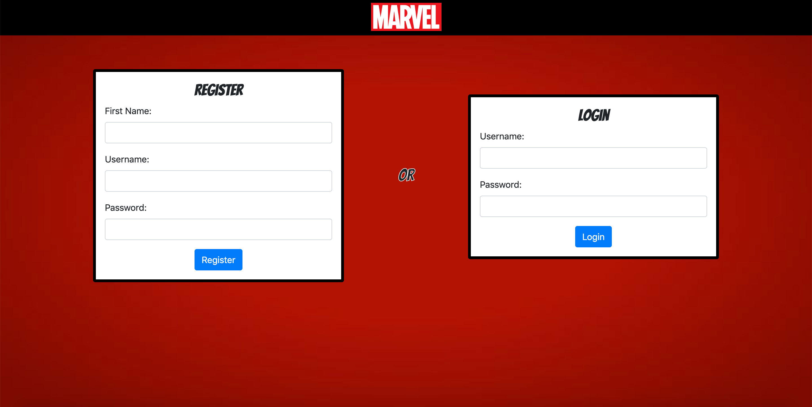
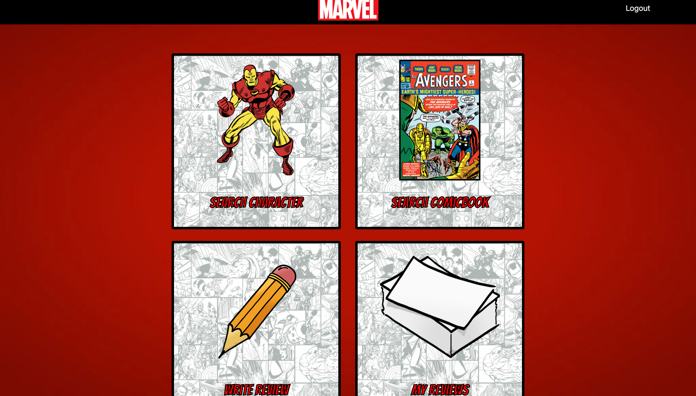
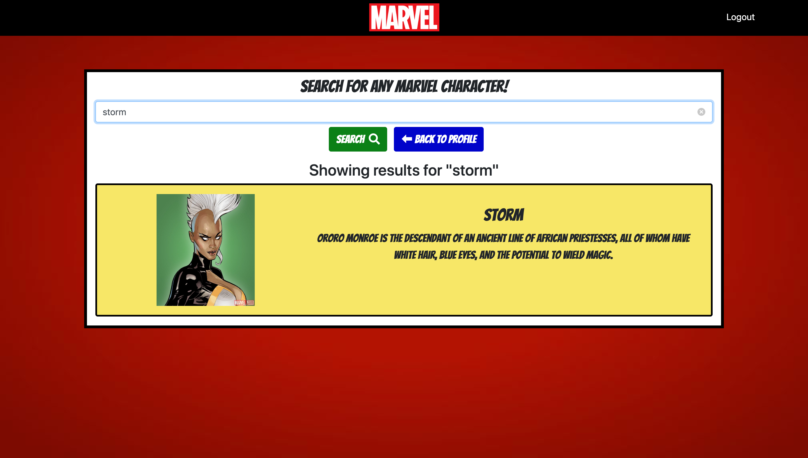
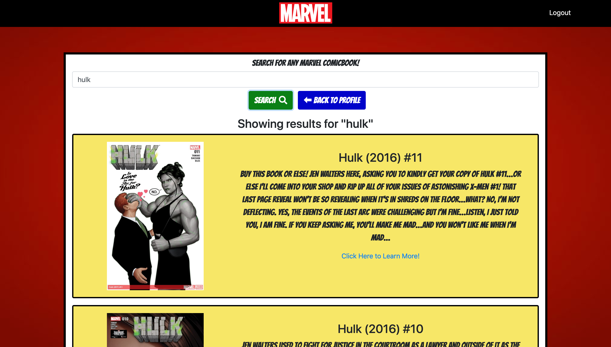
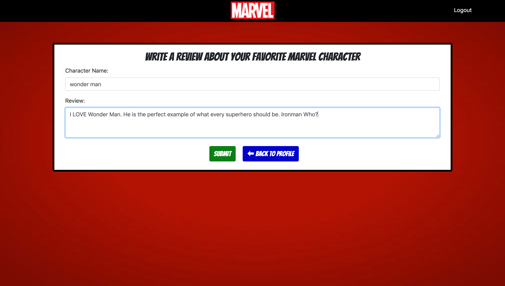
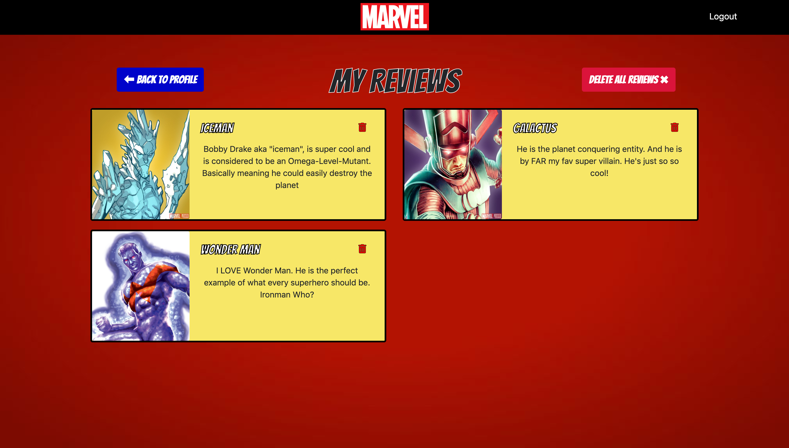

# Marvel Review App

### Links:
Demo - [https://loganveik.github.io/weatherdashboard](https://loganveik.github.io/weatherdashboard)
Repo - [https://github.com/loganveik/marvelapp](https://github.com/loganveik/marvelapp)

### Description:
This app, onece signed in, lets the user search for any character/comicbook. The user may also create a character review as well as view said reviews.

### Technologies Used:
Handlebars, Bootstrap4, CSS3, Javascript, jQuery, Ajax, NodeJS, Express, MySQL, Sequelize, Passport, Bcrypt, Marvel API.

### How to Use:
1) Once on the site, you MUST register a new account and then login immeditely after.

2) Once logged in, you'll be on your profile page, where you either search the Marvel API's database for any character or Comicbook. Or you can write your own custom reviews for ANY caharacter as well as view all your reviews.

3) Clicking "Search Character" will bring you to a searchbar which allows you to search the Marvel API's database for any character. (Please note, some characters are missing descriptions).

4) Clicking "Search Comicbook" will bring you to a searchbar which allows you to search the Marvel API's database for any comicbook. (Please note, some comicbooks are missing descriptions).

5) Clicking "Write Review" will let you write a custom review for your favorite Marvel hero or villain. 

6) Clicking "My Reviews" will reveal all reviews that have been made by user.
